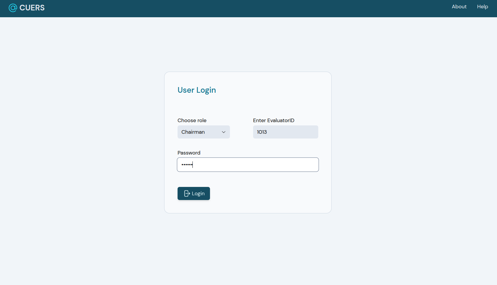
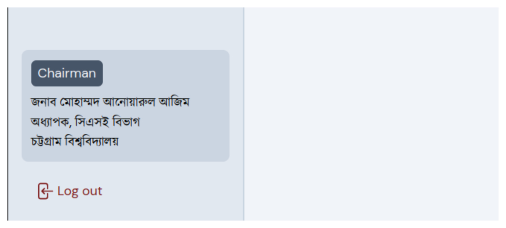
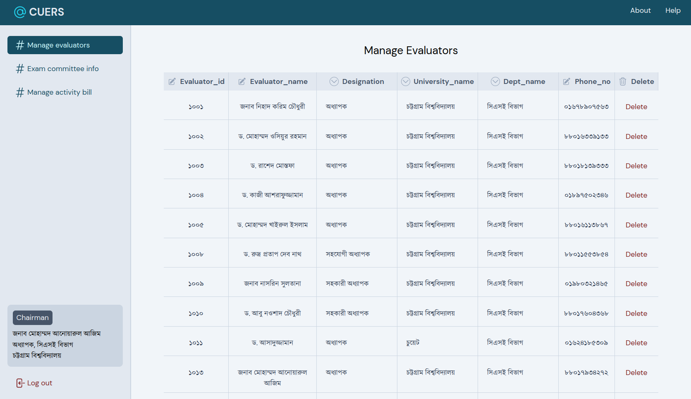
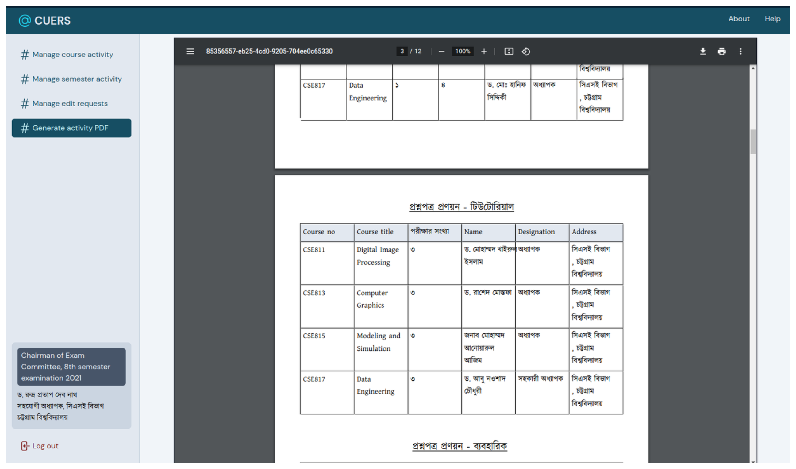
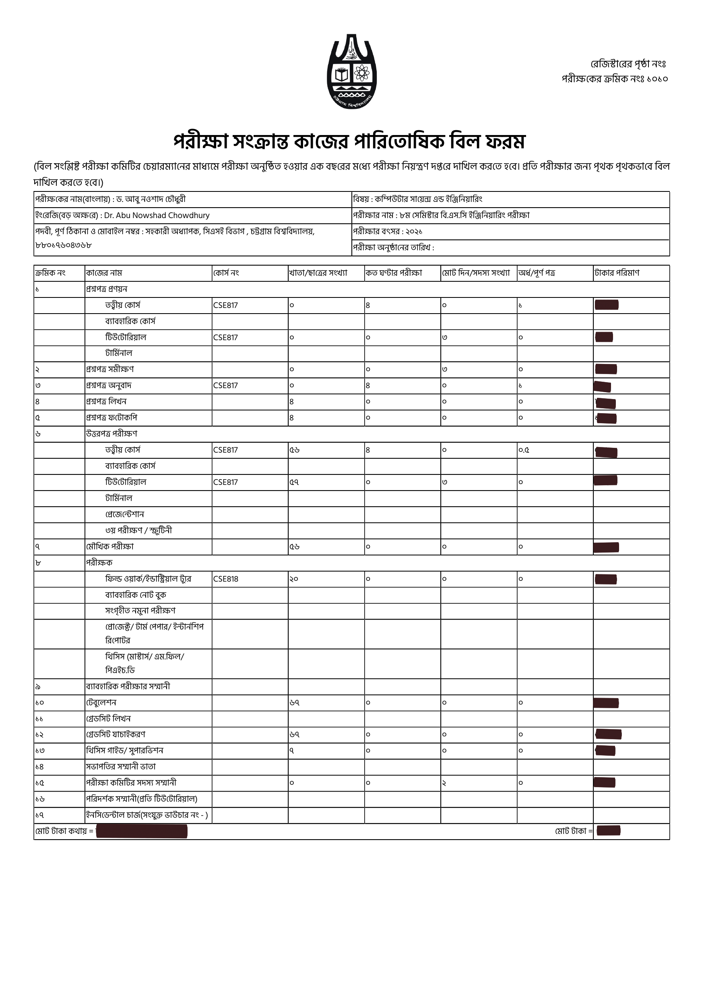

<link rel="stylesheet" type="text/css" href="README-styles.css">

# <h1 align = "center"> CUERS SERVER </h1>

+ _Note: This is the back-end section of the CUERS (Chittagong University Exam Remuneration System). The front-end section of the system is referred [here](https://github.com/Md-Kais/CUERS-New )._
## Table of Contents
- [Overview](#overview)
- [Installation](#installation)
- [Features](#features)
- [Getting Started](#getting-started)
- [Acknowledgements](#acknowledgements)
- [Contribution](#contribution)
## Overview
CUERS is a web-based digital exam remuneration system with a centralized database, containing all information about the evaluators (teachers) and exam-committee members of each department of University of Chittagong. In an effort to generate the remuneration forms and subsequently the bills of each evaluator correctly, the system significantly reduces the workload and time needed by digitizing the whole process.

## Installation
These instructions will provide you with a local copy of the project for deployment or testing purposes. Make sure to following the steps listed below:
### Cloning Repository
1. Clone the repository into your local system:
```
git clone https://github.com/Md-Kais/CUERS_SERVER.git
```
2. Navigate to your project directories using the command:
```
cd CUERS_SERVER
```
### Installing Dependencies
1. In your local system, ensure that Node.js & npm are already installed. To check whether they are installed, run the following commands in either your Ubuntu terminal or Windows Command Prompt:
```
#Check npm version
npm -v 

#Check node version
node -v
```
To install either or both of them, please follow the [Node.js](https://nodejs.org/en/download/package-manager "Node.js installation via package manager") and [npm](https://docs.npmjs.com/downloading-and-installing-node-js-and-npm "Downloading and installing Node.js and npm") documentations.

2. Install the Express.js in the project directory by entering the command:
```
npm install express
```
You can read the documentations of [Express.js](https://expressjs.com/en/starter/installing.html) to get more detailed instructions.

### Usage
1. To start the Express.js server, run the following command:
```
nodemon app.js
```
* _Make sure the front-end server is also running. Refer to the guidelines mentioned [here](https://github.com/Md-Kais/CUERS-New)._

## Features
* Centralized database that holds all information of evaluators of the University of Chittagong while ensuring privacy & security.
* Generate full-fledged remuneration bills, by automating bill calculations from provided data.
* Allow insertion, deletion and/or updating data records dynamically and handling noisy data.

## Getting Started
Here's a general instruction that allows an user to use our system.
### Login/Logout
User can log in as Chairman/CEC/evaluator from the application’s login page by providing the correct password and evaluatorID.

To log out, user can tap at the Log out button on the left bottom portion of the page.


### Dynamically Modifying Info in Table
After loging in, you can tap on the Manage evaluators option on the sidebar, which opens a new page where a table will be displayed that represents information of currently available evaluators in the system. Any information could be modified by tapping on any cell on the table. Some information allows you to select from a dropdown, while others allow you to write them directly on the cell. Also, any record could be deleted by tapping the delete button.

As the system does input authentication, it forbids any invalid data on the cell. If the user inputs any, the system will show an error message.


### Generate Activity PDF
To generate activity pdf, log in as Chairman of Exam committee and tap at the Generate activity pdf at the sidebar. This will open a new page that will load the pdf after some processing of the available information given as the semester activity and course activity. The pdf could be downloaded locally.


### Generate Bill PDF
To generate bill pdf, log in as Evaluator and tap at the Generate bill pdf option at the sidebar. This will open a new page that will load the pdf after some processing of the available information. The pdf could be downloaded locally.


## Technologies Used
<div class = "img-display">
<a href="https://developer.mozilla.org/en-US/docs/Web/JavaScript" ></a>
<a href="https://expressjs.com/" ></a>
</div>

## Acknowledgements
This project has been developed using confidential data records provided by [Dr. Rudra Pratap Deb Nath](https://www.cu.ac.bd/public_profile/index.php?ein=5168), Associate Professor of CSE Dept and [Muhammad Anwarul Azim](https://cu.ac.bd/public_profile/index.php?ein=3904), Professor and Chairman of CSE Dept of University of Chittagong.

## Contribution
If you would like to contribute to this project, please fork the repository and submit a pull request. When submitting a pull request, please make sure to include unit tests for any new features or bug fixes.
